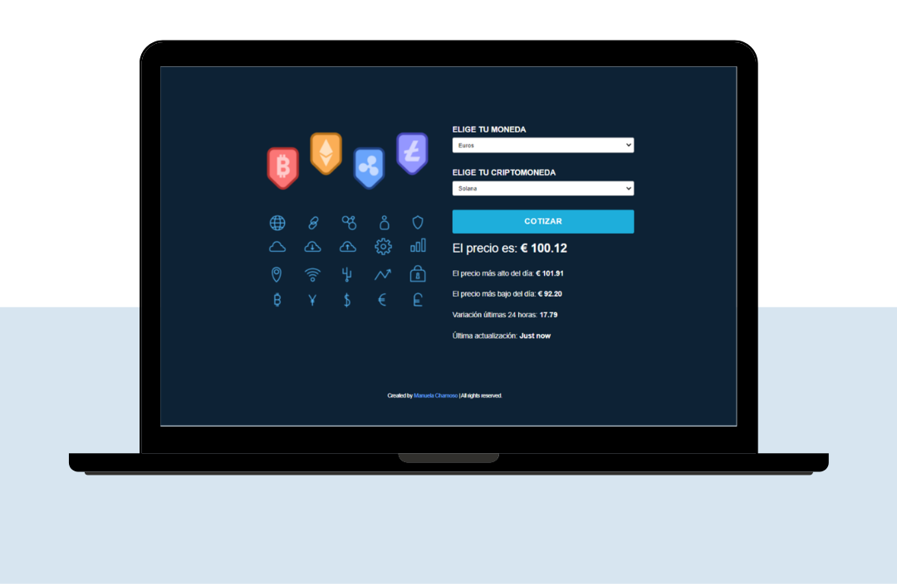

# API-project-cryptocurrency

API used to this project: [CryptoCompare](https://min-api.cryptocompare.com/documentation?key=Price&cat=SingleSymbolPriceEndpoint&api_key=2854a5c3399c288c9183d204216c9c5d706e7d55bb64cd5a67eda10db684a574)

This project is responsive.
